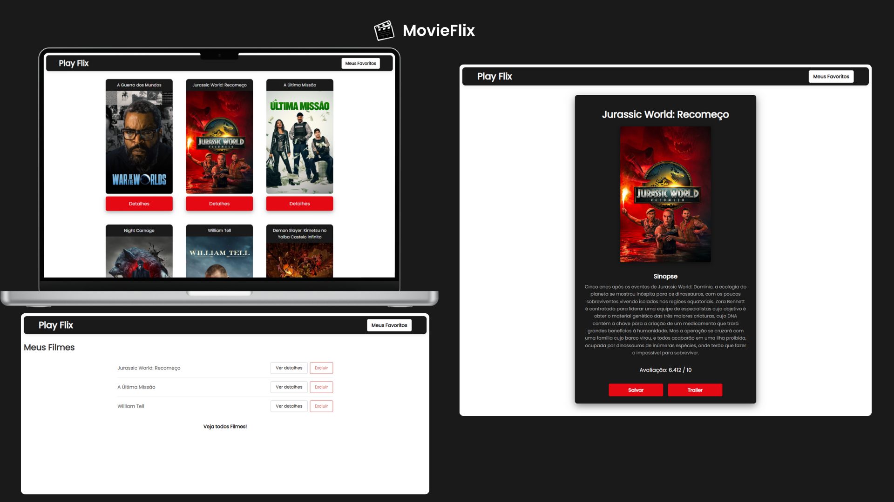

MovieFlix

Uma aplicação web de filmes em React consumindo dados de uma API externa: TMDB API. 
O usuário pode ver os filmes mais populares, ver detalhes, salvar os filmes para lista de favoritos e buscar trailers sendo redirecionado no youtube.

## Demo do Projeto: 
Demo do Projeto:
<a href="https://pablo-cruzbr.github.io/MovieFlix/" target="_blank">Clique aqui para ver a demo</a>

## Tecnologias e Bibliotecas
Este projeto foi desenvolvido utilizando as seguintes tecnologias e bibliotecas essenciais:

* **React:** A principal biblioteca para a construção da interface de usuário.
* **React Router DOM:** Para gerenciar a navegação e o roteamento das páginas da aplicação.
* **Axios:** Uma biblioteca para fazer requisições HTTP de forma simples, usada para buscar dados de APIs externas.
* **The Movie Database (TMDB)API v3 (playlistItems)**: rota GET para listar vídeos de uma playlist específica. <a href="**https://developer.themoviedb.org/docs/getting-started**" target="_blank">Clique aqui para ver a API</a>
  
* **React Toastify:** Uma ferramenta para exibir notificações personalizadas e fáceis de usar, melhorando o feedback para o usuário (ex: "Filme salvo com sucesso!").
* **Local Storage (via React Hooks):** Utilizado para persistir dados no navegador, como a lista de filmes favoritos, garantindo que as informações não sejam perdidas ao recarregar a página.

---

## Como Iniciar o Projeto

Para rodar este projeto localmente, siga os passos abaixo:

1.  **Clone o repositório:**
    ```bash
    git clone [https://docs.github.com/articles/referencing-and-citing-content](https://docs.github.com/articles/referencing-and-citing-content)
    ```

2.  **Instale as dependências:**
    ```bash
    cd MovieFlix
    npm install
    ```

3.  **Inicie o servidor de desenvolvimento:**
    ```bash
    npm run dev
    ```

4.  A aplicação estará disponível em `http://localhost:3000`.

---

## 📝 Observações
* A biblioteca `react-router` foi atualizada para `react-router-dom`, que é a versão padrão para aplicações web.
